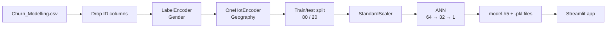

# Customer Churn Prediction

Predicts whether a bank customer is likely to leave (churn) using an **artificial neural network** built with TensorFlow/Keras, served through an interactive **Streamlit** web app.

Enter a customer's details (credit score, geography, age, balance, tenure and more) and the app returns a live churn probability along with a clear prediction.

## What it does

- **Data preprocessing:** drops identifier columns, label-encodes gender, one-hot encodes geography and standardizes all features with `StandardScaler`.
- **Neural network model:** a compact feed-forward ANN (64 → 32 → 1) trained for binary classification with Adam and binary cross-entropy.
- **Training safeguards:** `EarlyStopping` on validation loss (patience 5, best weights restored) to prevent overfitting.
- **Experiment tracking:** training runs logged with **TensorBoard** (loss, accuracy and weight histograms).
- **Reusable artifacts:** the trained model (`model.h5`) and fitted encoders/scaler (`.pkl`) are saved, so the app gets identical preprocessing at inference time.
- **Interactive app:** a Streamlit form that turns customer inputs into a churn probability in real time.

## Dataset

[`Churn_Modelling.csv`](Churn_Modelling.csv) contains **10,000 bank customers** from France, Germany and Spain.

| Feature | Description |
|---|---|
| `CreditScore` | Customer's credit score |
| `Geography` | Country (France, Germany, Spain) |
| `Gender` | Male / Female |
| `Age` | Customer age |
| `Tenure` | Years with the bank (0–10) |
| `Balance` | Account balance |
| `NumOfProducts` | Number of bank products used (1–4) |
| `HasCrCard` | Has a credit card (1 / 0) |
| `IsActiveMember` | Active member (1 / 0) |
| `EstimatedSalary` | Estimated yearly salary |
| **`Exited`** | **Target: 1 = churned, 0 = stayed** |

`RowNumber`, `CustomerId` and `Surname` are dropped because they carry no predictive signal.

## Pipeline



## Model

| Layer | Units | Activation | Parameters |
|---|---|---|---|
| Dense (input: 12 features) | 64 | ReLU | 832 |
| Dense | 32 | ReLU | 2,080 |
| Dense (output) | 1 | Sigmoid | 33 |
| **Total** | | | **2,945** |

- **Optimizer:** Adam (learning rate 0.001)
- **Loss:** Binary cross-entropy
- **Metric:** Accuracy
- **Batch size:** 32, up to 100 epochs
- **Callbacks:** EarlyStopping (`val_loss`, patience 5, `restore_best_weights=True`) and TensorBoard

## Results

Early stopping halted training after 7 epochs and restored the best weights (lowest validation loss):

| Metric | Value |
|---|---|
| Validation accuracy | **~81%** |
| Validation loss | 0.417 |

Validation was done on the 20% hold-out split (2,000 customers). Because only about 20% of customers in the dataset churned, accuracy alone can flatter the model; see *Future improvements*.

## Project structure

```
Customer-Churn-Prediction/
├── Churn_Modelling.csv          # dataset
├── experiments.ipynb            # preprocessing, training, TensorBoard
├── prediction.ipynb             # loading the model and predicting on new data
├── app.py                       # Streamlit web app
├── model.h5                     # trained Keras model
├── label_encoder_gender.pkl     # fitted gender encoder
├── onehotencoder.pkl            # fitted geography encoder
├── scaler.pkl                   # fitted StandardScaler
├── logs/fit/                    # TensorBoard training logs
├── requirements.txt
├── runtime.txt                  # python-3.11 (for deployment)
└── LICENSE                      # GPL-3.0
```

## Run it

**1. Clone the repository**

```bash
git clone https://github.com/parthchaitanya/Customer-Churn-Prediction.git
cd Customer-Churn-Prediction
```

**2. Create a virtual environment (Python 3.11)**

```bash
python -m venv venv
source venv/bin/activate        # Windows: venv\Scripts\activate
```

**3. Install dependencies**

```bash
pip install -r requirements.txt
```

**4. Launch the app**

```bash
streamlit run app.py
```

Open `http://localhost:8501`, fill in the customer details and read the churn probability.

**5. (Optional) View training logs**

```bash
tensorboard --logdir logs/fit
```

Then open `http://localhost:6006`.

## Example

| Input | Value |
|---|---|
| Geography | France |
| Gender | Female |
| Age | 42 |
| Credit Score | 619 |
| Balance | 0 |
| Tenure | 2 |
| Products | 1 |
| Has Credit Card | Yes |
| Active Member | Yes |
| Estimated Salary | 101,348.88 |

The app prints the churn probability (0–1). Anything above **0.5** is flagged as *likely to churn*.

## Tech stack

Python 3.11 · TensorFlow 2.19 / Keras · scikit-learn · pandas · NumPy · TensorBoard · Matplotlib · Streamlit

## Future improvements

- Report precision, recall, F1 and ROC-AUC alongside accuracy, since the classes are imbalanced.
- Handle class imbalance with class weights or SMOTE.
- Add a separate validation split so the test set stays untouched until final evaluation.
- Tune hyperparameters (layers, units, dropout, learning rate) with KerasTuner.
- Save the model in the native `.keras` format instead of legacy HDF5.
- Explain predictions with SHAP so users see *why* a customer is flagged.

## License

This project is licensed under the [GPL-3.0 License](LICENSE).
